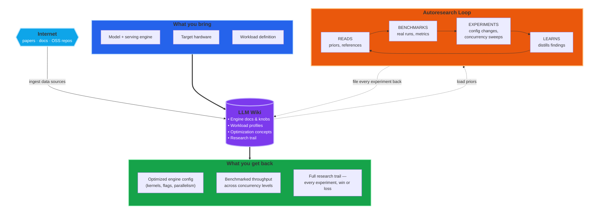

# LLM Serving Performance Auto-optimization

> **Serving optimization that feels like cheating.**
> Point an LLM agent at your serving engine and workload, come back to an **optimized configuration** with a fully documented research trail.

This repository is an experiment in **autonomous LLM serving engine performance optimization**, end-to-end: benchmark execution, metrics analysis, hypothesis generation, and result synthesis — all run by an LLM agent against a knowledge base it maintains itself.

The claim is structural, not incremental: **given a sufficiently capable LLM, the right benchmarking tools, and a knowledge base that includes the engine's documentation and optimization references, an autonomous agent can drive any (model, engine, workload) triple to near-optimal serving performance**. This isn't a replacement for ML engineers — it's a force multiplier. The engineer stays in charge of direction (picking targets, adjudicating contradictions, deciding which gains are worth keeping); the agent absorbs the legwork (reading docs, generating hypotheses, running benchmarks, profiling, writeup).

Built on [Karpathy's autoresearch](https://github.com/karpathy/autoresearch) methodology and adapted from the [TPU Performance Autoresearch Wiki](https://github.com/vlasenkoalexey/tpu_performance_autoresearch_wiki).

---

## The Core Components

### Serving Engines

**[vLLM](https://github.com/vllm-project/vllm)** — PagedAttention-based serving with continuous batching, prefix caching, chunked prefill, speculative decoding, and first-class GPU and TPU backends.

**[SGLang](https://github.com/sgl-project/sglang)** — RadixAttention serving engine with automatic prefix caching via radix-tree KV cache, overlap scheduling, data-parallel attention, and structured output support.

**[TensorRT-LLM](https://github.com/NVIDIA/TensorRT-LLM)** — NVIDIA's TensorRT-optimized engine with ahead-of-time compilation, architecture-specific kernel auto-tuning, and highest single-GPU throughput on NVIDIA hardware.

### Agentic Workload Profiles

This repo focuses on **high-concurrency agentic AI workflows** — the serving patterns that emerge when LLMs act as autonomous agents:

- **Multi-turn agentic** — agent loops with tool calls, growing context, high prefix reuse across turns
- **Parallel tool use** — burst of concurrent requests sharing a long prefix, short structured output
- **Long context RAG** — long prompt (10K–128K tokens), short answer; stresses prefill throughput and KV cache capacity
- **Chain-of-thought** — short prompt, long reasoning output; stresses decode throughput and CUDA graph efficiency
- **Structured output** — JSON/schema-constrained decoding; measures constraint overhead on throughput

Each workload is defined as a structured profile in `wiki/workloads/` with request patterns, concurrency characteristics, and representative benchmark commands.

### Autoresearch Loop

**Autoresearch** — introduced in [Karpathy's autoresearch repo](https://github.com/karpathy/autoresearch) — is a methodology for letting an LLM agent run an open-ended research program: propose ranked hypotheses, run experiments, evaluate outcomes, revise priors, feed what it learned into the next round.

Applied to LLM serving, the loop runs continuously: **hypothesis → engine config change → benchmark sweep across concurrency levels → metrics comparison → profile-grounded verdict → writeup → next round.** Every experiment, winning or losing, is recorded as context for the next hypothesis. The discipline is what makes the loop compound — each experiment permanently improves the priors for the next one.

```
┌─────────────────────────────────────────────────────────┐
│  SOURCES + ENGINE DOCS + BENCHMARKS                     │
│            ↓ (inform)                                   │
│  CONCEPTS + ENGINES + WORKLOADS                         │
│            ↓ (suggest)                                  │
│  HYPOTHESES (ranked: expected gain × confidence / cost) │
│            ↓ (selected)                                 │
│  BENCHMARKS (config change + run + measure)             │
│            ↓ (produce)                                  │
│  OBSERVATIONS (what the metrics show)                   │
│            ↓ (update)                                   │
│  CONCEPTS + HYPOTHESES (priors revised, new candidates) │
└─────────────────────────────────────────────────────────┘
```

### LLM Wiki

A knowledge base of plain markdown files on disk, with a schema, cross-linked by relative paths, backed by an `index.md` the LLM reads first on every task. The wiki stores engine documentation, workload definitions, optimization concepts, experiment records, and reusable observations. No vector DB, no embeddings — retrieval is `grep`, deterministic and auditable.

The wiki is self-writing: every experiment result is filed back as permanent context, so the agent gets smarter over time.

**Bonus**: point [Obsidian](https://obsidian.md/) at the wiki directory for a navigable graph view with backlinks, search, and tag filtering.

### Benchmark Harness

[`benchmark_harness.py`](benchmark_harness.py) automates the benchmark cycle:
1. Launch a serving engine with a given config
2. Run a workload profile at multiple concurrency levels
3. Parse throughput and latency metrics from output
4. Write structured JSON results to `raw/benchmarks/`

```bash
python benchmark_harness.py \
  --engine vllm \
  --model meta-llama/Meta-Llama-3-8B-Instruct \
  --workload multi-turn-agentic \
  --config '{"enable_prefix_caching": true, "max_num_seqs": 128}' \
  --output-dir raw/benchmarks/2026-04-29-prefix-cache-vllm \
  --launch-server
```

---

## Putting it all together

An agent that knows the serving engines, understands agentic workload patterns, can run benchmarks end-to-end, can pinpoint bottlenecks from metrics, and records every experiment as context for the next one. Every cycle leaves the wiki smarter than before.



## What this unlocks

- **Optimization that feels like cheating.** Describe a goal — "maximize throughput for multi-turn agentic workloads at 128 concurrency on H100" — come back to an optimized configuration with a research trail showing every experiment that led there.
- **Cross-engine comparison.** Run the same workload against vLLM, SGLang, and TensorRT-LLM, then let the agent attribute performance differences to concrete config choices (scheduler policy, attention backend, KV cache strategy, CUDA graph capture).
- **Dramatic ramp-up speedup.** Browse `engines/` → `workloads/` → `hypotheses/` → `experiments/` to build a mental model of serving optimization in hours instead of weeks.
- **Self-improving knowledge.** Every experiment — winners and losers — is filed back into the wiki. A finding like "prefix caching plateaus at 75% context reuse" becomes a prior the agent applies automatically.

---

## Repo layout

```
SCHEMA.md              single source of truth — page types, operations, rules.
CLAUDE.md              @SCHEMA.md pointer for Claude Code.
GEMINI.md              @SCHEMA.md pointer for Gemini CLI.
benchmark_harness.py   automated benchmark runner for vLLM / SGLang / TensorRT-LLM.
wiki/                  LLM-owned markdown (index, log, page types per schema).
  index.md             cross-section — updated on every write.
  log.md               append-only event log.
  engines/             one page per serving engine (architecture, knobs, surfaces).
  workloads/           agentic workload profiles (request patterns, concurrency).
  sources/             ingested papers, docs, talks.
  codebases/           ingested repos (one page per repo).
  concepts/            techniques, abstractions, flags, kernels.
  models/              each model under optimization.
  hypotheses/          ranked candidate optimizations.
  experiments/         runs — config, benchmark link, metrics, verdict.
  observations/        reusable findings pulled from benchmarks / runs.
  analyses/            syntheses, cross-engine comparisons.
raw/                   immutable inputs — never modified.
  sources/             PDFs, HTML snapshots.
  code/                ingested repos (git submodules).
  profiles/            profiling traces (Nsight, xprof, etc.) (gitignored).
  benchmarks/          benchmark results, configs (gitignored).
  assets/              figures, plots.
```

---

## Quick Start — On a GPU Instance

### 1. Provision

Rent a GPU instance (Neo Cloud, Lambda, RunPod, etc.) with:
- **OS**: Ubuntu 22.04 + CUDA 12.x
- **GPU**: 1x A100/H100 (24GB+ VRAM) for 8B models, 2–4x for 70B
- **Disk**: 100GB+ (model weights are large)

### 2. Bootstrap

```bash
git clone https://github.com/PrimaLabs-AI/llm-serving-autoresearch-wiki
cd llm-serving-autoresearch-wiki
./setup.sh --docker
```

This installs Docker, NVIDIA Container Toolkit, pulls engine images, and sets up the benchmark environment.

### 3. Configure

```bash
cp .env.example .env
```

Edit `.env`:

```bash
# Model to benchmark
MODEL=meta-llama/Meta-Llama-3-8B-Instruct

# HuggingFace token — required for gated models (Llama, Mistral, Qwen)
# Get yours at: https://huggingface.co/settings/tokens
# Then accept the model license on its HuggingFace page
HF_TOKEN=hf_xxxxxxxxxxxxxxxxxxxxxxxxxx
```

### 4. Run

**Option A — Autonomous loop** (zero human input):
```bash
./run_loop.sh --model meta-llama/Meta-Llama-3-8B-Instruct --rounds 5
```
Claude picks hypotheses, runs benchmarks, ingests results, writes experiment pages, proposes next experiments — all automatically.

**Option B — Manual benchmark sweep**:
```bash
./run_eval.sh --model meta-llama/Meta-Llama-3-8B-Instruct
```
Sweeps all engines × all workloads × all concurrency levels. Results in `raw/benchmarks/<date>-summary.md`.

**Option C — Interactive** (Claude Code session):
```bash
# Start an engine
docker compose up -d vllm

# Wait for healthy
docker compose logs -f vllm   # Ctrl+C when ready

# Start Claude
claude
# "Run hypothesis #1 — prefix caching for multi-turn agentic workloads."
```

### 5. Validate first (no token needed)

Test the pipeline with a tiny ungated model before spending GPU hours:
```bash
./run_loop.sh --model TinyLlama/TinyLlama-1.1B-Chat-v1.0 --rounds 2
```

---

## Architecture

```
┌──────────────────────────────────────────────────────────────┐
│  GPU Instance                                                │
│                                                              │
│  ┌──────────────┐  ┌──────────────┐  ┌──────────────┐       │
│  │  vLLM        │  │  SGLang      │  │  TRT-LLM     │       │
│  │  :8000       │  │  :30000      │  │  :8001       │       │
│  │  (Docker)    │  │  (Docker)    │  │  (Docker)    │       │
│  └──────┬───────┘  └──────┬───────┘  └──────┬───────┘       │
│         │                 │                 │               │
│         └─────────────────┼─────────────────┘               │
│                           │                                 │
│              ┌────────────┴────────────┐                    │
│              │  Autoresearch Loop      │                    │
│              │  (run_loop.sh + Claude) │                    │
│              │  - reads wiki           │                    │
│              │  - picks hypotheses     │                    │
│              │  - runs benchmarks      │                    │
│              │  - writes results       │                    │
│              │  - proposes next round  │                    │
│              └─────────────────────────┘                    │
└──────────────────────────────────────────────────────────────┘
```

Each engine runs in its own Docker container (official images) to avoid dependency conflicts. The autoresearch loop orchestrates them via Docker Compose.

---

## Three Modes of Operation

### Mode 1: Autonomous Loop (`run_loop.sh`)

Fully self-driving. No human intervention after starting it.

```bash
./run_loop.sh --model <model> --rounds 5
```

Each round:
1. Claude reads the wiki state (hypotheses, prior experiments)
2. Picks the top-ranked open hypothesis
3. Starts the appropriate engine container with a config change
4. Runs benchmarks across concurrency levels
5. Ingests results — writes experiment page, updates hypothesis status
6. Proposes new hypotheses for the next round
7. Repeats

Output: updated wiki pages + `raw/benchmarks/<date>-loop-log.md`

```bash
# Options
./run_loop.sh --model meta-llama/Meta-Llama-3-8B-Instruct --rounds 10
./run_loop.sh --model meta-llama/Meta-Llama-3-8B-Instruct --rounds infinity  # run until done
```

### Mode 2: Benchmark Sweep (`run_eval.sh`)

Run a predefined sweep across engines and workloads.

```bash
./run_eval.sh --model meta-llama/Meta-Llama-3-8B-Instruct                  # everything
./run_eval.sh --engines vllm,sglang --workloads multi-turn-agentic         # targeted
./run_eval.sh --model meta-llama/Meta-Llama-3-8B-Instruct --dry-run        # see what it would do
./run_eval.sh --setup                                                       # bootstrap only
```

Output: `raw/benchmarks/<date>-summary.md` with cross-engine comparison tables.

### Mode 3: Manual (`claude` or `docker compose`)

Full control. You decide what to test.

```bash
# Start an engine with custom config
docker compose up -d vllm

# Run a specific benchmark
python benchmark_harness.py \
  --engine vllm \
  --model meta-llama/Meta-Llama-3-8B-Instruct \
  --workload multi-turn-agentic \
  --config '{"enable_prefix_caching": true, "max_num_seqs": 128}' \
  --skip-server \
  --output-dir raw/benchmarks/$(date +%Y-%m-%d)-prefix-cache-test

# Start Claude to analyze
claude
```

---

## Recommended Models

| Model | Size | GPU needed | HF token | Use for |
|---|---|---|---|---|
| TinyLlama/TinyLlama-1.1B-Chat-v1.0 | 1.1B | Any GPU | No | Pipeline validation |
| meta-llama/Meta-Llama-3-8B-Instruct | 8B | 1x A100/H100 | Yes | Real benchmarks |
| Qwen/Qwen2.5-7B-Instruct | 7B | 1x A100/H100 | Yes | Alternative arch |
| meta-llama/Meta-Llama-3.1-70B-Instruct | 70B | 2–4x A100/H100 | Yes | Multi-GPU optimization |

Start with TinyLlama to validate, then Llama-3 8B for real work.

---

## Current Seed Hypotheses

| # | Hypothesis | Engine | Workload | Expected | Confidence | Effort |
|---|---|---|---|---|---|---|
| 1 | Prefix caching for multi-turn agentic | vLLM | multi-turn-agentic | 20-40% throughput | high | S |
| 2 | FP8 quantization increases max concurrency | vLLM | multi-turn-agentic | 50-80% more conc | high | S |
| 3 | SGLang RadixAttention vs vLLM | SGLang | multi-turn-agentic | 15-30% vs vLLM | medium | M |
| 4 | Chunked prefill for high concurrency | vLLM | parallel-tool-use | 25-40% TTFT reduction | medium | S |
| 5 | Speculative decoding for chain-of-thought | vLLM | chain-of-thought | 1.5-2x output tok/s | medium | M |

See [`wiki/index.md`](wiki/index.md) for the live ranked list.

---

## Ingested codebases (inherited from TPU wiki)

This repo inherits the codebase ingestion structure from the [TPU Performance Autoresearch Wiki](https://github.com/vlasenkoalexey/tpu_performance_autoresearch_wiki). The ingested repos under `raw/code/` cover JAX, profiling, kernel libraries, reference trainers, and inference engines — useful as optimization reference when comparing serving approaches.

Key references for serving optimization:
- [tpu-inference](raw/code/tpu-inference) — vLLM's TPU inference backend
- [sglang-jax](raw/code/sglang-jax) — SGLang's JAX port
- [maxtext](raw/code/maxtext) — reference JAX trainer for multiple model families
- [jax](raw/code/jax) — JAX with first-party TPU kernels (flash attention, paged attention, splash attention)

See the [original repo](https://github.com/vlasenkoalexey/tpu_performance_autoresearch_wiki#ingested-codebases-current) for the full list.

---

## FAQ

**Is this production-ready?**
No. This is a research project. Treat every number with engineer-grade skepticism — verify against your own benchmarks.

**Does it need a specific LLM?**
The wiki is plain markdown. Tested with Claude Code and Gemini CLI. Any agent that can run tools + read/write markdown should work.

**Does it need specific hardware?**
No. The benchmark harness runs against any GPU server with vLLM/SGLang/TensorRT-LLM installed. The optimization loop is hardware-agnostic — just update the engine config and workload profile for your setup.

**What if my engine / workload / model isn't in the wiki yet?**
Create a page using the templates in [`SCHEMA.md`](SCHEMA.md). That's the whole onboarding flow.

**Can it change my model's semantics?**
The protocol explicitly forbids it. Any optimization that degrades output quality beyond acceptable thresholds is marked `invalid` and not reported as a win (see [`SCHEMA.md`](SCHEMA.md) rule #8).

---

## Authoritative contract

[`SCHEMA.md`](SCHEMA.md) defines page types, operations, frontmatter, naming, verdict suffixes, and behavioral rules. If anything in this README conflicts with `SCHEMA.md`, the schema wins.

---

*Built on [Karpathy's autoresearch](https://github.com/karpathy/autoresearch) methodology. Adapted from the [TPU Performance Autoresearch Wiki](https://github.com/vlasenkoalexey/tpu_performance_autoresearch_wiki).*
