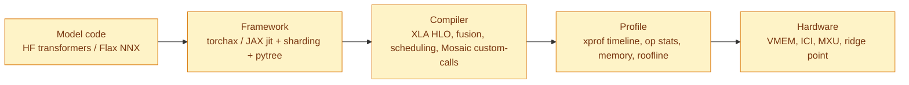
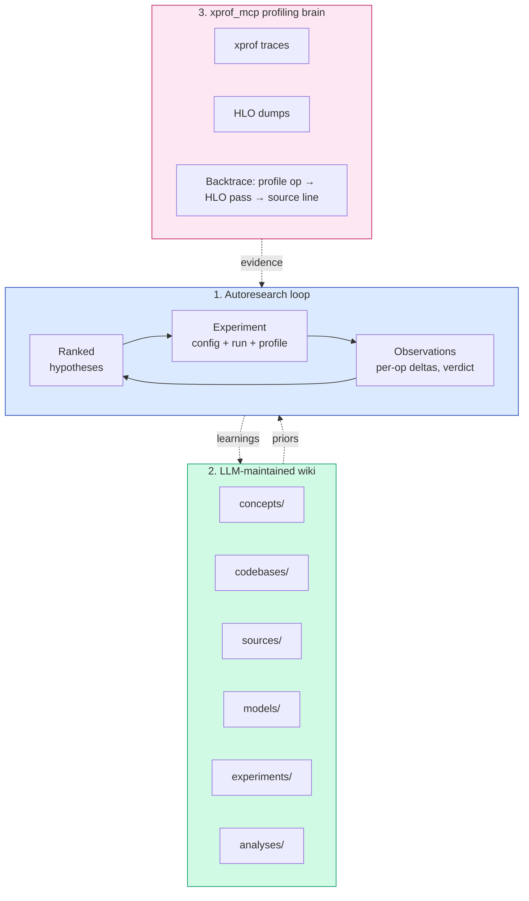

# TPU Model Performance Auto-optimization

> **Model optimization that feels like cheating.**
> Point an LLM agent at your training script and hardware target, come back to a **state-of-the-art-capable configuration** with a fully documented research trail.

This repository is an experiment in **autonomous TPU model performance optimization**, end-to-end: profile analysis, hypothesis generation, experiment execution on real hardware, and result synthesis — all run by an LLM agent against a knowledge base it maintains itself.

The claim is structural, not incremental: **given a sufficiently capable LLM, the right profiling tools, and a knowledge base that includes the model's + framework's source, an autonomous agent can drive any (model, hardware) pair to state-of-the-art performance for that combination** — matching what a senior TPU perf engineer would achieve, but much faster, much cheaper, and with the full decision log preserved.

## The Core Components

### Autoresearch - specialized to TPU perf

**Autoresearch** — introduced in [Karpathy's autoresearch github repo](https://github.com/karpathy/autoresearch) — is a methodology for letting an LLM agent run an open-ended research program: propose ranked hypotheses, run experiments, evaluate outcomes, revise priors, feed what it learned into the next round. The methodology is **domain-agnostic** — any question you can frame as a ranked set of falsifiable experiments with measurable outcomes is a candidate. Karpathy's original target was LLM pretraining *quality* (architectural and optimizer tweaks judged by loss); **this repository specializes the same loop to TPU model *performance*** — wall-clock step time, tokens/sec, MFU, memory budget.

Applied in this repo, the loop runs continuously: **hypothesis → minimal code diff → benchmark on real hardware → profile + HLO capture → op-by-op diff against the prior best → profile-grounded verdict → writeup + ledger row → next round.** Every experiment, winning or losing, is recorded as context for the next hypothesis and submitted to a separate git branch. Successful experiments are built on top of each other creating a hierachical tree of ideas that play best together. The discipline is what makes the loop compound rather than oscillate — each experiment permanently improves the priors for the next one. The rest of this section describes the supporting components that make that discipline possible in the TPU-perf domain.

### Xprof MCP - profiling as a first-class LLM capability

Autoresearch is a feedback loop: hypothesize → experiment → **observe** → revise. Without the *observe* step grounded in real signal, the loop collapses into flag-guessing. For TPU performance optimization, "real signal" means knowing where each millisecond of step time goes, which tensor sits where in HBM, and where every op lands on the roofline. The source of truth is [**XProf**](https://github.com/openxla/xprof), OpenXLA's official TPU profiler — step-time breakdown, per-HLO-op runtime + memory traffic, collective-overlap timing, roofline classification, memory timeline.

Raw XProf is a web UI, not something an LLM agent can use directly. We bridge the gap with [**xprof_mcp**](https://github.com/vlasenkoalexey/xprof-mcp), an [MCP](https://modelcontextprotocol.io/) server that turns XProf into a set of programmatic tools the LLM calls directly.

Besides analyzing profiles, it also exposes an API to access **HLO dumps** — produced when the trainer is launched with [`XLA_FLAGS="--xla_dump_to=<dir> --xla_dump_hlo_as_text"`](https://openxla.org/xla/flags_guidance) — which lets the LLM connect profile information back to the [**optimized HLO**](https://openxla.org/xla/architecture#xla_the_tensorflow_compiler_framework) (what XLA actually executes on the TPU, after layout assignment, fusion, scheduling, collective-fusion, and remat passes) and to the [**original HLO**](https://openxla.org/xla/operation_semantics) (the IR the framework — JAX or torchax — emitted before XLA's optimization passes ran). From there the LLM can backtrace the original HLO back to the line of model code that produced it.

### LLM Wiki — collection of domain knowledge on TPU optimization

Out of the box, an LLM's knowledge of TPU performance is thin — it has a rough sense of FLOPs, attention, and general ML training, but not much sense of XLA optimization passes, VMEM budgets, splash attention's block-size knobs, how torchax dispatches through JAX, or the quirks of any particular Pallas kernel. The usual fix for this kind of gap is **RAG** — retrieve snippets from a vector database at query time. That works, but it's probabilistic (you hope the right chunk lands in the top-k), expensive to set up (embedding pipeline, vector store, rank tuning), and hard to audit after the fact.

A lighter alternative, popularized by Karpathy in his [**LLM wiki gist**](https://gist.github.com/karpathy/442a6bf555914893e9891c11519de94f), is to just build a wiki: plain markdown files on disk, with a schema, cross-linked by relative paths, backed by an `index.md` the LLM reads first on every task. Retrieval is `grep` — deterministic, auditable, near-free. No vector DB, no embeddings, no rank tuning. The LLM reads what it needs and writes what it learns, and because markdown is human-readable too, a person can open the wiki at any time and see exactly what the LLM "knows" about the domain.

In this repo the wiki lives under [`wiki/`](wiki/), with [`SCHEMA.md`](SCHEMA.md) as the single source of truth for page types and operating rules. Every page has YAML frontmatter (type, tags, created/updated dates) and a fixed H2 layout per type. **Concept pages** cover a single technique, compiler flag, or hardware feature (MFU, splash attention, rematerialization, ICI roofline, etc.). **Codebase pages** carry annotated *performance-relevant surfaces* tables that point the LLM at exactly the files and line-ranges that matter. **Source pages** summarize ingested papers, docs, and tutorials. **Experiment pages** carry the run's config, linked profile, op-by-op diff, and a verdict. **Analysis pages** synthesize across experiments when a pattern emerges. Everything is cross-linked; [`wiki/index.md`](wiki/index.md) is the navigation root; [`wiki/log.md`](wiki/log.md) is an append-only event log. The **index-first-then-edit** protocol means the LLM grep-checks the index before creating a new link, so broken cross-references don't creep in. Crucially, **the wiki grows as the LLM uses it** — every ingested paper, every new experiment, every generalizable observation becomes a page that makes every later session smarter. The knowledge base is no longer a one-time setup cost; it's a by-product of the research loop itself.


---

## Why TPU performance optimization is normally painful

A slow training step rarely has one cause. Tracking it down requires following a signal across **five different layers of the stack**:



The knowledge to navigate this is spread across ~20 repositories, a dozen papers, XLA flag catalogs, and institutional memory. Ramp-up is weeks. A single optimization experiment — hypothesis → branch → code change → 20-step TPU run → profile analysis → diff → verdict → writeup — takes a senior engineer a full day.

This project is a bet that **an LLM with the right tooling and the right knowledge base can run that loop faster than a human, and keep running it after hours**.

---

## The idea: three Karpathy-inspired ingredients, stacked



### 1. Autoresearch loop — discipline that makes results reproducible

Formalize optimization as a research program. Every candidate optimization enters as a **falsifiable hypothesis** with expected delta and measurement plan. Every experiment ends with a **verdict** tied to a profile and a noise band. Every dead end is documented; every win is traceable to the profile signal that motivated it.

Adapted from the [`autoresearch`](raw/code/autoresearch) reference implementation and specialized to TPU perf in [`SCHEMA.md`](SCHEMA.md). The LLM runs the loop; the human sets targets and arbitrates contradictions.

### 2. Wiki as external memory — the LLM doesn't fit the stack in context

Give the LLM a structured markdown wiki it **maintains itself** as it learns the domain:

| Kind | Count | What it is |
|---|---:|---|
| `concepts/` | 96 | MFU, splash attention, rematerialization, ICI roofline, scan-over-layers, … |
| `codebases/` | 26 | Ingested repos with performance-relevant surfaces annotated — JAX, xprof, torchax, tokamax, 15+ Pallas-kernel libraries, scaling-book, inference engines. |
| `sources/` | 45 | Papers, xprof docs, scaling-book chapters, tutorials. |
| `models/` | 1 | Target model with baseline, current best, open hypothesis queue. |
| `experiments/` | 50+ | Per-run writeups — config, profile, HLO diff, verdict. |
| `analyses/` | 4 | Synthesis pages — ceiling reports, Pallas-kernel directory, process retrospectives. |

Total **180+ LLM-maintained pages**, cross-linked, indexed, grepped before every write. Index-first-then-edit is a protocol rule — the LLM never invents a link to a page that doesn't exist.

### 3. xprof_mcp — the profiling brain

The leverage point that makes autonomous optimization work. [`xprof_mcp`](raw/code/xprof-mcp) is an MCP server that exposes xprof the way a senior TPU performance engineer uses it:

- `list_runs` / `get_overview` — step-time breakdown, MFU, duty cycle.
- `get_top_hlo_ops` / `get_op_profile` — ranked hot ops with FLOPs / bytes / roofline classification.
- `get_memory_profile` — HBM allocation, peak-instant breakdown, fragmentation.
- `get_hlo_dump_neighborhood` — **fuse a profile op with its surrounding HLO** so the LLM can trace which fusion decision produced it.

Most importantly, it stitches profile data to HLO dumps so the agent can **backtrace a hot op from the profile, through XLA's optimization passes, all the way to the source line that produced it**. Combined with the ingested codebases (§2), that means when a Pallas custom-call shows up in the profile, the LLM can click through to the exact kernel source and reason about its block sizes, layout, and shard_map specs.

Without xprof_mcp, the LLM sees step time and loss. With it, the LLM can ask "why is this op slow" and follow the answer all the way down the stack.

---

## What this unlocks

- **Optimization that feels like cheating.** Describe a goal in a sentence. Come back to a configuration at or near the hardware's achievable ceiling, with a linked research trail showing every experiment that led there. The LLM picks the right experiments because it has read the right papers, studied the right code, and learned from every prior experiment it ran on this model.
- **Debug the framework, not just the model.** Most TPU perf issues aren't in your model — they're in torchax's dispatch, JAX's sharding plan, or a Pallas kernel's `shard_map` wrapping. With the framework source ingested, the LLM can read it. When torchax's `JittableModule` dedup produced a tied-weight crash (exp 2), the agent pinpointed the cause by grepping `raw/code/torchax/`. When scan-over-layers + XLA SDPA regressed −60 % (exp 51), it explained the mechanism by cross-referencing JAX's scan lowering with the attention code path.
- **Ask questions, let the LLM explore.** "Why are we OOM-ing at batch=4?" "What kernel would help the loop-fusion bucket?" "Does splash win at seq=2048?" — the LLM reads the profile, surfaces the relevant prior experiments, proposes the next hypothesis, runs it. You don't need to know what to ask next.
- **Dramatic ramp-up speedup.** An engineer new to TPU perf can browse `concepts/` → `analyses/` → `experiments/` and build a real mental model in hours instead of weeks. The wiki is a curriculum that **writes itself as it's used**.
- **Generalizable findings, written down.** A recent run discovered that **Pallas custom-calls only beat XLA when XLA wasn't already fusing the pattern** — confirmed twice independently (exp 33 Pallas RMSNorm, exp 47 levanter fused CE, both rejected at the same boundary tax). That insight now lives in [an analysis page](wiki/analyses/2026-04-24-gemma4-jax-ceiling-and-process-retrospective.md) and will guide every future Pallas hypothesis. Writing this down is what turns 50 experiments into leverage for the next 50.

---

## The experiment loop, in practice

```mermaid
sequenceDiagram
  participant H as Human
  participant L as LLM agent
  participant W as Wiki
  participant T as TPU
  participant M as xprof_mcp
  H->>L: "Optimize Gemma 4 on v6e-4; target MFU"
  L->>W: Read index.md, model page, OBSERVATIONS.md
  L->>W: Rank open hypotheses by gain × confidence / effort
  L->>H: "Top hypothesis: splash attention. Approve?"
  H->>L: go
  L->>T: Create branch perfautoresearch/...-exp8-splash-attention
  L->>T: Apply code change, launch 20-step run with profile
  T->>M: capture trace + HLO dump
  L->>M: get_overview, get_top_hlo_ops, get_memory_profile
  L->>L: compare vs baseline, assign verdict
  L->>W: Write experiment page, append OBSERVATIONS.md block
  L->>W: Append RESULTS.tsv row, update model page's ranked list
  L->>H: "exp 8 accepted: +2.7 % TPS, splash's 122 ms custom-call replaces 170 ms of XLA fusion. Next?"
```

Each experiment's artifacts:

- a git branch (named rollback point)
- a profile directory under `raw/profiles/` + an xprof browser URL in the writeup
- a verdict-suffixed markdown page (`…-accepted.md` / `…-rejected.md` / `…-potential.md`)
- a row in the stack's `RESULTS.tsv` ledger
- a block appended to `OBSERVATIONS.md`

The full arc is **auditable** — not "the LLM made it faster somehow" but "here is every experiment, every result, every reason, and every line of code that changed".

---

## Real findings this project has produced

A partial list of generalizable lessons discovered autonomously during optimization runs — each grounded in specific experiments with profile evidence:

| Finding | Where | Why it matters |
|---|---|---|
| **Pallas custom-calls only win when XLA isn't already fusing** | exp 33 (RMSNorm rejected), exp 47 (fused CE rejected) — same mechanism twice | Saves you from building Pallas RMSNorm / SwiGLU / standard CE kernels that XLA already handles well. |
| **Scan-over-layers requires internally-tiled attention** | exp 51 — scan + XLA SDPA is −60 %, scan + splash is workable | Don't use scan on TPU without flash/splash. XLA SDPA can't share `[B,H,S,S]` score tensors across scan iterations. |
| **Per-chip batch has a mechanistic sweet spot set by HBM ceiling** | observed on both stacks; past ~85 % HBM, per-token cost worsens | Activations scale linearly with batch; past the ceiling, memory pressure degrades execution. Finding is shape-dependent, mechanism isn't. |
| **Persistent JAX compile cache: 6.67× wall-clock on repeat** | exp 45 | Trivial infra win; always-on after first experiment of a session. |
| **Native JAX beats torchax on same hardware by ~3.7 %** | exp 36 vs exp 25 | Torchax's `JittableModule` dispatch + HF-cache-class pytree adds per-op overhead. Quantified. |
| **The 1.25 GiB `CompileTimeHbmOom` margin on torchax is a scaffold artifact** | torchax exp 10/11/22/23 all failed by same margin; JAX port at same config runs | Flax NNX's leaner pytree closes the gap exactly. |

Every row above links to an experiment page with the raw data and profile.

---

## Repo layout

```
SCHEMA.md           single source of truth — page types, operations, rules.
CLAUDE.md           @SCHEMA.md pointer for Claude Code.
GEMINI.md           @SCHEMA.md pointer for Gemini CLI.
wiki/               LLM-owned markdown (index, log, page types per schema).
  index.md          cross-section — updated on every write.
  log.md            append-only event log.
  sources/          ingested papers, docs, talks.
  codebases/        ingested repos (one page per repo, performance-relevant surfaces annotated).
  concepts/         techniques, hardware features, compiler flags, kernels.
  models/           each model under optimization.
  hypotheses/       ranked candidate optimizations.
  experiments/      runs — config, profile link, metrics, verdict.
  observations/     reusable findings pulled from profiles / runs.
  analyses/         syntheses, ceiling reports, directories.
raw/                immutable inputs — never modified.
  sources/          PDFs, HTML snapshots of papers.
  code/             ingested repos (git submodules) — model code + framework + kernels.
  profiles/         xprof traces, HLO dumps (gitignored, multi-GB per run).
  assets/           figures, plots.
```

---

## Get started

Clone with submodules (the `raw/code/` dir pulls ~26 codebases totalling ~GB; use `--depth` if that matters to you):

```bash
git clone --recurse-submodules https://github.com/vlasenkoalexey/tpu_performance_autoresearch_wiki
cd tpu_performance_autoresearch_wiki
```

Or on an existing clone:

```bash
git submodule update --init --recursive
```

Start an LLM agent session (Claude Code, Gemini CLI, etc.) in this directory. The agent reads [`SCHEMA.md`](SCHEMA.md) and [`wiki/index.md`](wiki/index.md) on first turn and knows how to operate the wiki.

To run the optimization loop against your own model:

1. Add the model's training repo as a submodule: `git submodule add <url> raw/code/<slug>`
2. Ask the agent to ingest it: *"Ingest raw/code/<slug> as a codebase page, highlighting performance-relevant surfaces."*
3. Create a model page under `wiki/models/<slug>.md` with baseline metrics and a hardware target.
4. Ask the agent: *"Formulate the top 5 optimization hypotheses for this model on v6e-4, ranked by expected gain × confidence / effort."*
5. Approve hypotheses; the agent runs them, profiles them, files the results.

The rest is iteration. [`wiki/experiments/gemma4_autoresearch_optimization/`](wiki/experiments/gemma4_autoresearch_optimization/) is the worked example — browse the experiment pages in chronological order to see the loop in action.

---

## Add a new codebase to the wiki's working memory

```bash
git submodule add <repo-url> raw/code/<slug>
```

Then ask the agent to ingest it — see [`SCHEMA.md`](SCHEMA.md) → `INGEST-CODEBASE`. The agent will write a `wiki/codebases/<slug>.md` with a performance-relevant-surfaces table, generate concept stubs for any technique named that lacks a page, and propose new hypothesis candidates derived from the code.

---

## Ingested codebases (current)

The repos below are git submodules under `raw/code/` and have corresponding pages in `wiki/codebases/`. Together they cover the JAX stack, profiling, kernel libraries, reference trainers, inference engines, and research-lab artifacts.

### Foundation

- [jax](raw/code/jax) — JAX itself: transformations, sharding, `jax.profiler`, Pallas DSL, first-party TPU kernels (`flash_attention`, `splash_attention`, `paged_attention`, `ragged_paged_attention`, `megablox`, `matmul`, `all_gather`, `threefry`). Ground truth for everything downstream.
- [xprof](raw/code/xprof) — XProf profiler + TensorBoard plugin (OpenXLA). Profile capture + UI.
- [xprof-mcp](raw/code/xprof-mcp) — MCP server wrapping xprof for agent-driven analysis (the "profiling brain").
- [stablehlo](raw/code/stablehlo) — StableHLO op-set + MLIR dialect reference; consulted when reading HLO dumps.

### Frameworks

- [torchax](raw/code/torchax) — PyTorch-on-JAX interop layer (Google).
- [jax-huggingface](wiki/codebases/jax-huggingface.md) (under [learning-machine](raw/code/learning-machine)) — Qi Huang's JAX/ML tutorial series, including Llama-2 + SD2 on TPU.

### Kernels

- [tokamax](raw/code/tokamax) — OpenXLA custom TPU/GPU Pallas kernels (splash, GLU, layer_norm, ragged_dot, cross-entropy).
- [pallas-forge](raw/code/pallas-forge) — auto-tuning framework for Pallas kernels on TPU.
- [ejkernel](raw/code/ejkernel) — broadest community TPU Pallas surface (17 kernels).
- [ringattention](raw/code/ringattention) — canonical Pallas TPU ring-attention (Liu et al. 2023).
- [alphafold3](raw/code/alphafold3) (@ v3.0.1) — only public production Pallas fused GLU (GPU Triton-on-Pallas); kernels removed from `main` after v3.0.1.
- [recurrentgemma](raw/code/recurrentgemma) — DeepMind's canonical Mosaic-TPU LRU Pallas scan.
- [aqt](raw/code/aqt), [qwix](raw/code/qwix) — quantization frameworks; qwix is AQT's successor.

### Reference trainers & inference engines

- [maxtext](raw/code/maxtext) — AI-Hypercomputer reference JAX trainer for Gemma/Llama/DeepSeek/Qwen/Mistral/Kimi.
- [maxdiffusion](raw/code/maxdiffusion) — AI-Hypercomputer reference JAX diffusion trainer; first-class ring-attention integration.
- [tpu-inference](raw/code/tpu-inference) — vLLM's TPU inference backend; novel RPA v2/v3, MLA v1/v2, fused_moe v1, blockwise quantized_matmul, all_gather_matmul, GDN, SparseCore kernels.
- [sglang-jax](raw/code/sglang-jax) — SGLang's JAX port; ~2,000+ tuned block-size entries.
- [axlearn](raw/code/axlearn) — Apple's training framework; only public Pallas Mamba1 / Mamba2 / RAttention SSM kernels.
- [EasyDeL](raw/code/EasyDeL) — training/serving framework wrapping ejkernel.
- [marin](raw/code/marin) — vendors levanter; fused CE kernel with Gemma-style logit soft-cap + deployment-time autotune harness.

### Other

- [autoresearch](raw/code/autoresearch) — Karpathy's autoresearch reference implementation.
- [scaling-book](raw/code/scaling-book) — "How To Scale Your Model" (DeepMind).
- [graphcast](raw/code/graphcast) — DeepMind weather-forecasting model; splash-wrapper non-LLM example.
- [simply](raw/code/simply) — DeepMind serving framework.
- [jaxite](raw/code/jaxite) — FHE Pallas kernels (only non-ML Pallas TPU reference).

---

## FAQ

**Is this production-ready?**
No. This is a research project. The loop works on the Gemma 4 E4B / v6e-4 example in this repo; it should generalize, but treat every number with engineer-grade skepticism: verify against your own profiles.

**Does it need a specific LLM?**
The wiki is plain markdown + MCP. Tested with Claude Code and Gemini CLI. Any agent that can run tools + read/write markdown + query MCP servers should work.

**Does it need Google Cloud?**
Only if your TPU lives there. The wiki, profiles, and analyses are just files.

**What if my framework / model / hardware isn't ingested yet?**
Add it as a submodule under `raw/code/` and ask the agent to ingest it. That's the whole onboarding flow — see `INGEST-CODEBASE` in [`SCHEMA.md`](SCHEMA.md).

**Can it change my model's semantics?**
The protocol explicitly forbids it. Any optimization that changes loss trajectory beyond bf16-reorder noise is marked `-invalid` and not reported as a win (see [`SCHEMA.md`](SCHEMA.md) rule #6).

---

## Authoritative contract

[`SCHEMA.md`](SCHEMA.md) defines page types, operations, frontmatter, naming, verdict suffixes, and behavioral rules. If anything in this README conflicts with `SCHEMA.md`, the schema wins.

---

*This repository is itself run by the autoresearch loop. The commit history is the research log. Browse [`wiki/analyses/`](wiki/analyses/) for the recurring retrospectives.*
